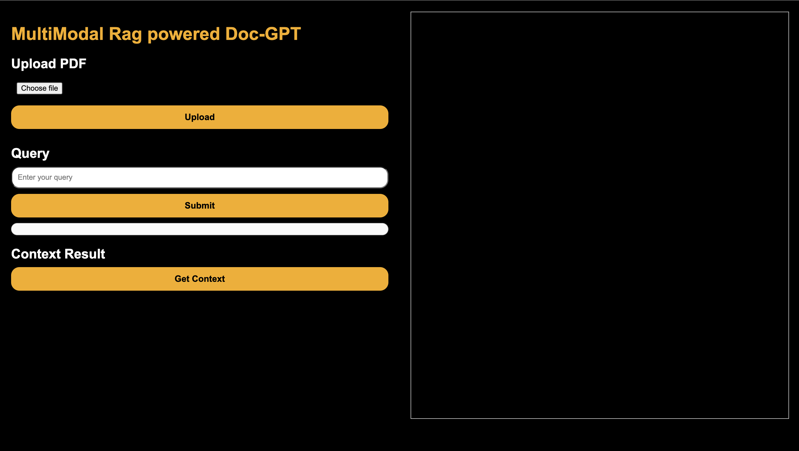
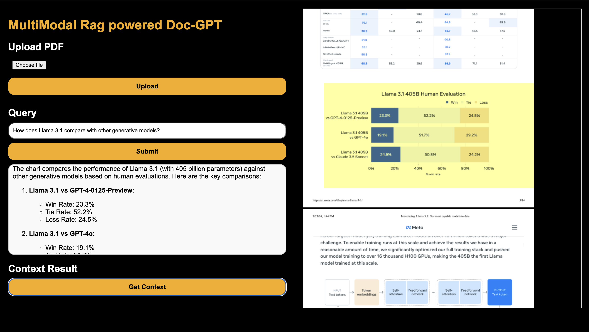
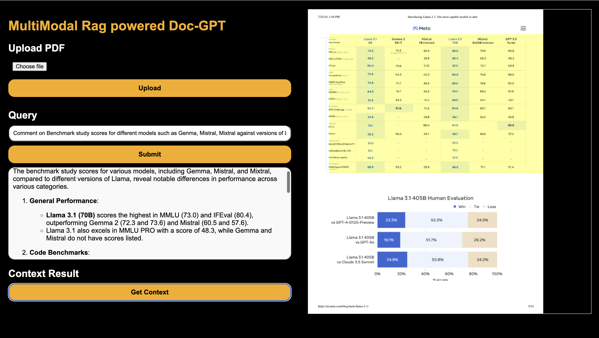
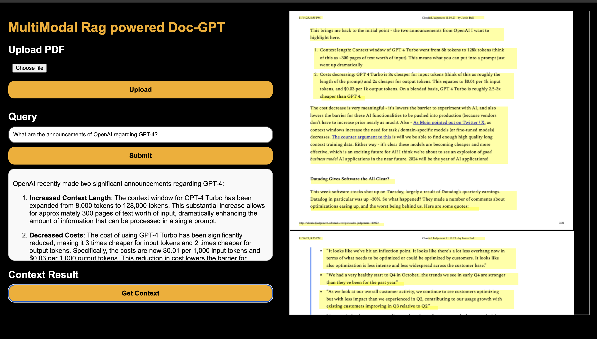
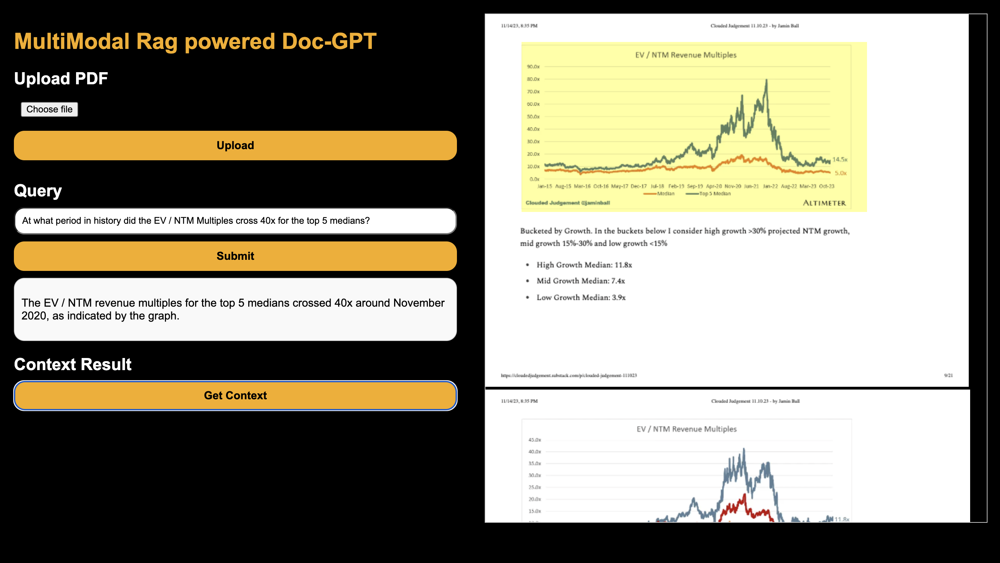

# MultiModal Rag powered Doc-GPT

## How to Install

### a. Install via Virtual Environment

1. **Create a virtual environment:**
    ```bash
    python -m venv test_env
    ```

2. **Activate the virtual environment:**
    - On Windows:
        ```bash
        test_env\Scripts\activate
        ```
    - On macOS/Linux:
        ```bash
        source test_env/bin/activate
        ```

3. **Install the dependencies:**
    ```bash
    pip install -r requirements.txt
    ```
4. **Set up OpenAI API key:**
    ```bash
    export OPENAI_API_KEY=your_openai_api_key_here
    ```

5. **Run the application:**
    ```bash
    uvicorn src.api:app --reload
    ```


### b. Install via Dockerfile

1. **Update the Dockerfile with the correct OpenAI API key:**
    - Open the Dockerfile and add the following line with your OpenAI API key:
        ```dockerfile
        ENV OPENAI_API_KEY=your_openai_api_key_here
        ```

2. **Build the Docker image:**
    ```bash
    docker build -t multimodal-rag-doc-gpt .
    ```

3. **Run the Docker container:**
    ```bash
    docker run -p 8000:8000 multimodal-rag-doc-gpt
    ```

## How to Use
1. **Open the Application:**
    - Open your web browser and navigate to `http://localhost:8000/static/index.html`.
    - you will see the application interface.


2. **Upload a PDF:**
    - Click on the "Choose file" button to select a PDF file from your computer.
    - Click the "Upload" button to upload the selected PDF.
    - Once the PDF is uploaded, you will see a green notification card on the top right corner of the screen.
    - At the moment the upload api supports only one pdf per upload. You can upload multiple pdfs by clicking the upload button multiple times. For starters, I have already added 3 sample pdfs in the `./src/uploads` folder. So you can directly go to the next step and test out any queries on them.

3. **Submit a Query:**
    - Enter your query in the text box under the "Query" section.
    - Click the "Submit" button to get the response based on the uploaded PDFs.
    - All the images, texts and tables will be considered as the context for the query, and the response will be generated based on the context.

4. **Get Context:**
    - Click the "Get Context" button to fetch the context result based on the uploaded PDF and query.
    - This functionality is based on the assumption that all the top relevant contexts the retriever fetched for the query come from the same pdf.
    - On the right side of the screen, you will see the pdf containing the context rendered in the browser.
    - After 0.5s of the pdf being rendered, the pdf will auto scroll to the page containing the context.
    - After 1-1.5 s of the pdf being rendered, the contexts used for the response generation will be highlighted in the pdf.
5. **Example Attachment:**
    - Here is an example of how the application interface looks when a PDF is uploaded and processed:
    

## Some of the beautiful multimodal extractions we have

1. **Example 1:**
    - This was the query: "Comment on Benchmark study scores for different models such as Genma, Mistral, Mixtral against versions of Llama" and the pdf used is at [0002.pdf](./src/uploads/0002.pdf)
    - Not only was the application able to fetch and highlight the relevant context from the pdf, but the response generated was also very good.
    

2. **Example 2:**
    - This was the query: "What are the announcements of OpenAI regarding GPT-4?" and the pdf used is at [0002.pdf](./src/uploads/0002.pdf)
    - The question was open ended, and the application was able to fetch and highlight the relevant context from the pdf, the context highlighted here could be debated as lengthy. There can be an improvement in the chunking strategy to make the context fetching more efficient.
    

3. **Example 3:**
    - This was the query: "At what period in history did the EV / NTM Multiples cross 40x for the top 5 medians?" and the pdf used is at [0003.pdf](./src/uploads/0003.pdf)
    - This question could only be answered by looking at a running plot of the EV / NTM Multiples. The application was able to identify the image to be relevant, and the response generated was also very good. This is a very good example of how the application can be used to answer questions that require visual context.
    

4. **Contextual Retrieval:**
    - The Multivector retriever indexes summaries and returns raw images or texts, providing accurate and contextually relevant responses to user queries.

5. **Multi-Modal Query Processing:**
    - The system processes queries by considering all available contexts, including text, images, and tables, to generate comprehensive responses.

6. **PDF Context Highlighting:**
    - When fetching context from PDFs, the relevant sections are highlighted and the PDF auto-scrolls to the page containing the context, enhancing the user experience.


## How the Backend Works

1. **PDF Processing:**
    - The PDF is processed using the `extract_pdf_elements` function to extract elements such as text, tables, and images.
    - This algorithm uses [`unstructured`](https://docs.unstructured.io/open-source/core-functionality/overview) library to extract the elements from the pdf. It uses `yolox` as the object detection model to detect the elements in the pdf.

2. **Categorizing Elements and Generating Metadata:**
    - The extracted elements are categorized into composite texts and table texts.
    - The elements are categorized into composite texts and table texts based on the `unstructured` library's default categories. This data is later used to generate metadata for the elements, using which we are able to identify the position of the elements in the pdf and highlight them in the pdf.

3. **Generating Texts, Images and Tables summaries:**
    - The elements are summarized into texts, images and tables using the `unstructured` library.
    - Instead of using Image embeddings (CLIP) along with text embeddings in the retriever, we plan to generate good and concise summaries for images and tables, which will be used as the text embeddings for the images and tables in the retriever.

4. **Creating or Updating Multi-Vector Retriever:**
    - The retriever indexes summaries and returns raw images or texts.

5. **Generating Response:**
    - The response is generated using the `rag` library.
    - Relevant code block:
        ```python:src/rag/rag_chain.py
        startLine: 19
        endLine: 75
        ```
    - In the rag chain, we invoke the retriever to fetch the top relevant contexts for the query.
    - If there are any images or tables in the contexts, we send the raw images or tables to the gpt-40-mini along with the query to generate the best possible summary that can be fetched from the images or tables.
    - The new contexts list is then re-ranked using the tf-idf vectorizer and cosine similarity.
    - The new re-ranked contexts are then used to generate the response.

## Next Steps to be Done

1. **Improve PDF Rendering:**
    - Ensure the PDF perfectly is readable on the browser, and the text can be selected and copied.

2. **Enhance Query Processing:**
    - Improve the accuracy and relevance of the responses to user queries.

3. **Optimize Performance:**
    - Optimize the backend processing to multiple pdfs and multiple queries at once.
    - Options to select and delete the uploaded pdfs.

4. **Display Dashboard:**
    - Display the dashboard with the uploaded pdfs and their info.

5. **Selective Document Querying:**
    - Option to select the Documents and ask questions on them.

6. **Multi-Document Context Rendering:**
    - If multiple documents are needed to answer the query, render the context of multiple documents and display them in the browser.

7. **Prompt Configurations:**
    - Improve the prompt engineering for the image and table summarization, and generation of response.
    - Have all the prompts configurable from one place.

8. **Implement Guardrails:**
    - Implement guardrails to prevent the application from hallucinating.
    - Implement guardrails to prevent the application from generating harmful or biased responses.
    - Implement guardrails to prevent the application from generating responses that are not relevant to the query.